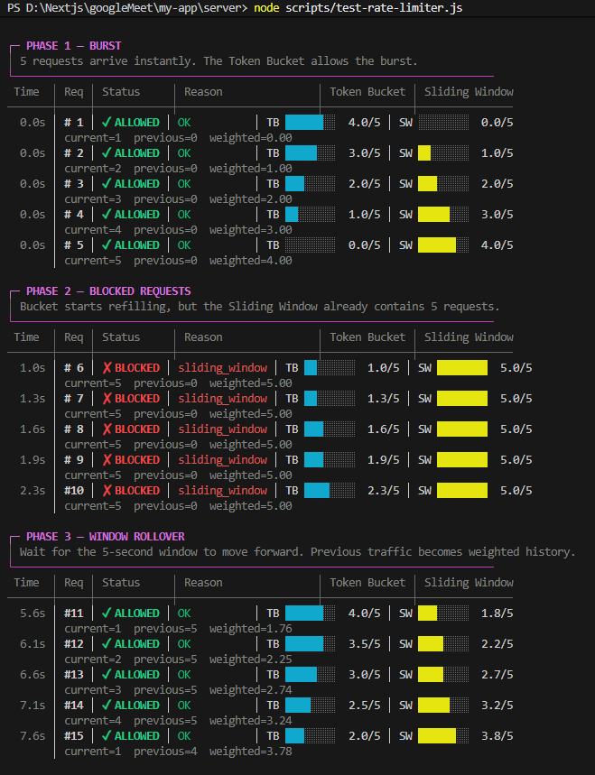

# Chatify

A real-time chat application with 1:1 and group messaging, live presence, friend requests, and WebRTC-powered audio/video calling — built on Next.js and a horizontally-scalable Express + Socket.IO backend.

## Project Structure

```text
my-app/

├── server/                  # Node.js and Express.js + Socket.IO backend
│   ├── src/
│   │   ├── config/          # env, session, passport config
│   │   ├── controllers/     # route handlers
│   │   ├── services/        # business logic (friends, messages, groups, calls)
│   │   ├── routes/           # Express route definitions
│   │   ├── middleware/       # Express middleware, including rate limiting
│   │   ├── socket/            # Socket.IO connection handling, call signaling
│   │   ├── db/                # Drizzle schema & client
│   │   ├── lib/               # shared singletons (socket instance, call store)
│   │   └── redis/             # Redis clients, BullMQ, pub/sub, rate limiter
│   │
│   ├── Scripts/
│   │   └── hybrid-limiter.lua # Atomic Redis Lua script for the hybrid rate limiter
│   │
│   └── test-rate-limiter.js   # Rate limiter test script
│
├── src/                      # Next.js frontend (App Router)
│   ├── app/                   # routes: /chat, /chat/conversation/[id], /users, /friends
│   ├── components/            # UI components (chat, calls, modals)
│   ├── providers/             # SocketProvider, CallProvider (React context)
│   └── lib/                   # API client, helpers
│
├── docs/
│   └── rate-limiter.png       # Hybrid rate limiter architecture/flow
│
├── public/
```

## Features

**## Hybrid Rate Limiter**

The rate limiter combines two algorithms because they solve different problems.



**### Token Bucket**

The Token Bucket controls \***\*burst traffic\*\***.

The current configuration is:

```text
capacity = 5 tokens

refillRate = 1 token/second

cost = 1 token/request
```

The bucket can hold a maximum of 5 tokens. Each request consumes tokens based on its configured cost. Tokens are continuously refilled according to the elapsed time, but never beyond the bucket capacity.

This means a client with 5 available tokens can make a short burst of up to 5 requests immediately. After the burst, the bucket recovers at 1 token per second.

```text
Bucket capacity = maximum sudden burst

Refill rate     = how quickly burst capacity recovers
```

**### Sliding Window Counter**

The Sliding Window Counter controls the \***\*sustained request rate\*\***.

The current configuration is:

```text
windowSize  = 5 seconds

windowLimit = 5 requests
```

The limiter keeps the request count for:

```text
Current window

Previous window
```

Instead of storing every request timestamp, it estimates the number of requests in the current rolling window by weighting the previous fixed window based on how far the current window has progressed.

The calculation is approximately:

```text
estimatedCount =

    previousWindowCount × previousWindowWeight

    + currentWindowCount
```

The previous-window weight decreases as the current window progresses.

For example, halfway through a 5-second window:

```text
Previous window count = 4

Current window count  = 2

Weight = 0.5

Estimated count = (4 × 0.5) + 2

                = 4 requests
```

If the configured limit is 5 requests, the request can still be accepted.

This avoids the sharp reset that a simple fixed-window counter would have at the boundary between windows.

**### Why Combine Both?**

The two algorithms provide different protections:

```text
Token Bucket

    ↓

Controls sudden bursts

Sliding Window Counter

    ↓

Controls sustained request volume
```

The current configuration is:

```text
Token Bucket

capacity       = 5
refill         = 1 token/sec

Sliding Window

window         = 5 seconds
limit          = 5 requests
```

A client may be able to send several requests immediately because tokens are available, while the sliding window prevents the client from continuously exceeding the configured request volume.

**### Atomic Redis Lua Execution**

The rate limiter performs multiple operations:

```text
1. Read token bucket state

2. Calculate token refill

3. Read current/previous window counts

4. Calculate estimated window count

5. Decide whether the request is allowed

6. Update tokens and request count

7. Set Redis expirations
```

Doing these operations separately from Node.js could introduce race conditions when multiple requests arrive concurrently.

Instead, the entire operation is executed inside Redis through `hybrid-limiter.lua`.

```text
Node.js

   │

   │ EVALSHA

   ▼

Redis

   │

   └── hybrid-limiter.lua

          │

          ├── Token Bucket calculation

          ├── Sliding Window calculation

          ├── Allow / Reject decision

          └── Atomic state update
```

Because the Lua script executes atomically inside Redis, concurrent requests cannot interleave the read and update steps of the limiter.

**### Messaging**

- \***\*1:1 direct conversations\*\*** — auto-created the moment a friend request is accepted

- \***\*Group chat\*\*** — create groups from your friends list, add members later, live member roster

- \***\*Real-time delivery\*\*** via Socket.IO, scoped per-conversation for efficient fan-out

- \***\*Optimistic UI\*\*** — messages appear instantly on send, reconciled against the server response

- \***\*Unread counts & read receipts\*\*** — per-conversation cursor tracking (`lastReadMessageId` / `lastReadAt`)

- \***\*Live sidebar updates\*\*** — conversation list re-sorts and updates last-message/unread badges in real time without refetching the full list

**### Friends & Social**

- \***\*Friend request flow\*\*** — send, accept, reject, cancel, with duplicate/self/reverse-pending protection enforced at the DB level (partial unique indexes + check constraints)

- \***\*Discover users\*\*** — browse non-friends, see pending request state inline

- \***\*Real-time friend events\*\*** — requests, acceptances, and rejections update both parties' UI instantly, including live socket-room updates so already-connected clients don't need a reload

**### Presence**

- \***\*Online/offline status\*\***, scoped to friends only (not broadcast platform-wide, for privacy and efficiency)

- \***\*Grace-period disconnect handling\*\*** — brief network drops or page reloads don't flash a user offline

- \***\*Last-seen timestamps\*\*** persisted on true disconnect

**### Notifications**

- \***\*In-app real-time notifications\*\*** for friend requests, acceptances, and rejections

- \***\*Unread badge counter\*\*** with mark-as-read / mark-all-as-read

**### Audio & Video Calling**

- \***\*WebRTC peer-to-peer calling\*\*** (audio and video), signaled entirely over the existing Socket.IO connection — no separate media server required

- \***\*Full call lifecycle\*\*** — ringing, accept, reject, cancel, busy detection, ring timeout, and clean teardown on disconnect

- \***\*In-call controls\*\*** — mute/unmute mic, toggle camera on/off, with the peer notified of state changes

- \***\*Live call timer\*\***, synced to actual peer-connection establishment (not just signaling completion)

- \***\*Call history messages\*\*** — completed and missed calls are logged into the conversation as system messages, including duration

## Tech Stack

### Frontend

- **Next.js (App Router)** — server components for initial data fetching, client components for interactivity
- **React** — hooks-based state management, no external state library
- **Tailwind CSS** — utility-first styling
- **Socket.IO Client** — real-time transport
- **lucide-react** — icon set

### Backend

- **Node.js + Express** — REST API layer
- **Socket.IO** — WebSocket transport for real-time events, with Express session/Passport middleware bridged into the socket handshake for authenticated connections
- **Drizzle ORM** — type-safe schema and queries
- **PostgreSQL (Neon)** — primary datastore, serverless Postgres
- **Passport.js** — authentication (local + Google OAuth), session-based

### Real-Time & Infrastructure

- **Redis Pub/Sub** — powers the Socket.IO adapter, allowing real-time events (messages, presence, notifications, call signaling) to propagate correctly across multiple server instances rather than being trapped in a single process's memory
- **Redis + BullMQ** — background job queue for asynchronous work (e.g. transactional email), decoupled from the request/response cycle
- **Redis Session Store** — centralized session storage shared across all server instances, so authentication survives horizontal scaling and load-balanced deployments (rather than sessions being pinned to whichever instance issued them)
- **Redis + Lua** — atomic execution of the hybrid Token Bucket and Sliding Window Counter rate limiter
- **WebSockets (Socket.IO)** — bidirectional real-time event channel for messages, presence, notifications, and typing/room events
- **WebRTC** — peer-to-peer media transport for audio/video calls; Socket.IO is used purely as the signaling channel (SDP offer/answer and ICE candidate exchange), keeping actual audio/video traffic off the application server entirely

## Architecture Notes

### Why Redis Pub/Sub matters here

Without it, `io.to(room).emit(...)` only reaches sockets connected to _that specific_ Node process. The moment this app runs on more than one instance (e.g. behind a load balancer, or scaled on a PaaS), two users could easily land on different server processes and never receive each other's real-time events. Redis Pub/Sub backs the Socket.IO adapter so an emit on any instance is broadcast to every instance, which then delivers to its own locally-connected sockets — making the real-time layer horizontally scalable rather than single-process-bound.

### Why Redis-backed sessions matter here

Socket.IO authentication in this app works by running the same Express session + Passport middleware used for REST routes against each socket's handshake request. If sessions were stored in-memory (the Express default), a session created on one instance would be invisible to another — breaking login the moment traffic is load-balanced across multiple processes. A centralized Redis session store makes the session valid across the entire fleet.

### Why Redis-backed rate limiting matters here

The rate limiter stores its state in Redis rather than process memory. This means the same user's rate-limit state can be shared across multiple Node.js instances.

Without centralized state:

```text
Request → Server A → local limiter
Request → Server B → separate local limiter
```

The user could effectively receive a separate limit on each server.

With Redis:

```text
                 ┌── Server A ──┐
Client ──────────┤              ├── Redis Rate Limiter State
                 └── Server B ──┘
```

All instances evaluate the same token bucket and sliding-window state.

### Real-time event design

- **Personal room** (`userId`) — every authenticated socket joins a room named after its user ID. This is used for anything that must reach a user regardless of what page/conversation they currently have open: notifications, presence updates, sidebar conversation updates, and incoming call signaling.

- **Conversation room** (`conversation:{id}`) — joined only while a user is actively viewing that specific conversation, and authorized server-side against actual membership before the join is allowed. Used for the live message stream itself, keeping room membership proportional to _concurrently active viewers_ rather than total historical membership — this is what keeps the design viable even for users with hundreds of conversations.

- **Sidebar updates** are emitted as a separate, lightweight event (`sidebar:update`) to every conversation member's personal room, decoupled from the conversation-room broadcast — so the conversation list stays live no matter what page a user is on, without needing to join every conversation room up front.

### Calling architecture

Calls use plain WebRTC (peer-to-peer, mesh) rather than an SFU/media server. For 1:1 calls this is the simplest correct architecture — audio/video flows directly between the two browsers once ICE negotiation completes, and the application server only ever sees signaling metadata (offer/answer SDP, ICE candidates), never media itself. An in-memory call registry (per server instance, keyed by call ID) tracks active call state, ringing timeouts, and busy detection.

> A production deployment should add a TURN server (e.g. coturn or a hosted TURN provider) alongside the STUN servers currently configured, to ensure connectivity for users behind restrictive/symmetric NATs.

## Database Schema Highlights

- **Canonical pair ordering** enforced via check constraints on both `friendships` and `conversations` (direct), preventing duplicate rows for the same pair regardless of insert order
- **Partial unique indexes** — e.g. only one _pending_ friend request allowed per sender/receiver pair, without blocking new requests after a prior one was resolved
- **Circular FK handled correctly** — `conversations.lastMessageId` references `messages`, and `messages.conversationId` references `conversations`; insert order is: create conversation → insert message → update conversation's last-message pointer
- **Cursor-friendly composite indexes** on `messages(conversationId, createdAt DESC, id DESC)` for efficient paginated history queries

## Getting Started

### Prerequisites

- Node.js
- PostgreSQL database (Neon or self-hosted)
- Redis instance

### Environment Variables

Create a `.env` file in `server/` with (adjust to your actual config keys):

```env
DATABASE_URL=
REDIS_URL=
SESSION_SECRET=
GOOGLE_CLIENT_ID=
GOOGLE_CLIENT_SECRET=
CORS_ORIGIN=
PORT=
```

And in the Next.js root:

```env
NEXT_PUBLIC_API_URL=
NEXT_PUBLIC_SOCKET_URL=
```

### Installation

```bash
# Backend
cd server
npm install
npm run dev

# Frontend (from project root)
npm install
npm run dev
```

### Database Setup

```bash
cd server

npx drizzle-kit generate
npx drizzle-kit migrate
```

### Rate Limiter Configuration

The rate limiter can be configured through the middleware options:

```js
rateLimiter({
  capacity: 10,
  refillRatePerSec: 3,
  windowSizeMs: 3000,
  windowLimit: 15,
  cost: 1,
});
```

The configuration controls two independent dimensions:

```text
Token Bucket
capacity          → maximum burst size
refillRatePerSec  → token recovery rate

Sliding Window
windowSizeMs      → rolling time period
windowLimit       → maximum request volume
```

The middleware also exposes rate-limit information through response headers:

```text
X-RateLimit-Limit
X-RateLimit-Remaining
X-RateLimit-Window-Limit
X-RateLimit-Window-Count
Retry-After
```

When a request exceeds the configured limit, the API responds with:

```http
429 Too Many Requests
```

along with the reason and retry information.
